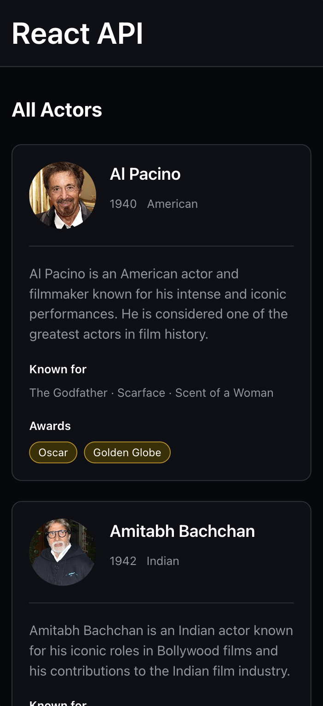

# React API

A React API fetching exercise from my web dev course. It displays actors and actresses in a responsive card grid with their personal details, movies, and awards.



## Exercise

Using the provided actors and actresses APIs:

- fetch both lists when the application loads;
- combine actors and actresses into a single list;
- render a card for each person;
- display their name, birth year, nationality, biography, image, and awards;
- include the movies they are best known for.

## Solution

The main solution is organized inside [`src/features/actors`](./src/features/actors):

- [`Actors.jsx`](./src/features/actors/Actors.jsx) manages loading, success, and error states;
- [`api.js`](./src/features/actors/api.js) fetches both API lists, while [`api.http`](./src/features/actors/api.http) contains requests for testing the endpoints;
- [`utils.js`](./src/features/actors/utils.js) normalizes the results and [`types.js`](./src/features/actors/types.js) documents the API data and state shapes;
- [`validation.js`](./src/features/actors/validation.js) validates the API data and throws an error if the data is invalid;
- [`components`](./src/features/actors/components) contains `ActorList` and `ActorCard`, together with their responsive styles;
- [`index.js`](./src/features/actors/index.js) exports the feature for use in the application.

The actor cards also reuse the shared `Card` and `Badge` UI components from [`src/components/ui`](./src/components/ui).

## Run locally

- Clone the repo `https://github.com/emanuelefavero/react-api.git`
- `cd` into the project folder
- Run:

  ```bash
  npm install
  npm run dev
  ```

- Open `http://localhost:5173` in your browser to see the app.
